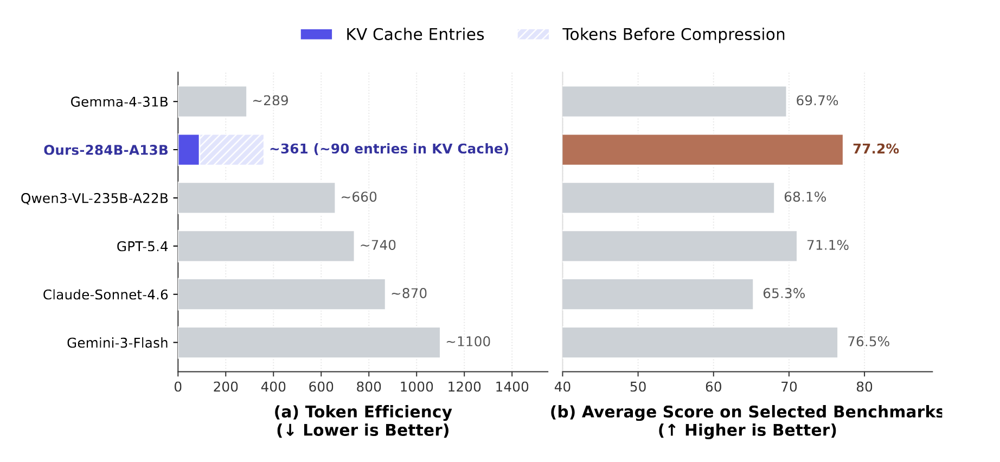

<!-- markdownlint-disable first-line-h1 -->
<!-- markdownlint-disable html -->
<!-- markdownlint-disable no-duplicate-header -->

<div align="center">
  
</div>
<hr>

<div align="center">
<h1>Thinking with Visual Primitives</h1>

</div>

<div align="center">

  <a href="https://www.deepseek.com/" target="_blank">
    
  </a>
  </a>
  <a href="https://huggingface.co/deepseek-ai" target="_blank">
    
  </a>

</div>


<div align="center">

  <a href="LICENSE-CODE">
    
  </a>
  <a href="LICENSE-MODEL">
    
  </a>
</div>


<p align="center">
  <a href="#2-license"><b>📜 License</b></a> |
  <a href="#3-citation"><b>📖 Citation</b></a> <br>
  <!-- 📄 Paper Link (<a href=""><b>Thinking with Visual Primitives</b></a> | -->

</p>


## News

**2026.04.30**: We have released the [technical report](./Thinking_with_Visual_Primitives.pdf) detailing our approach. In the near future, we plan to make the in-house benchmarks and a subset of our cold-start data publicly available. The model weights will be integrated into our foundation model and released in the future.


## 1. Introduction
While recent Multimodal Large Language Models (MLLMs) have made strides in bridging the *"Perception Gap"* (e.g., through high-resolution cropping or thinking with images), they still struggle with complex structural reasoning. We identify this bottleneck as the **Reference Gap**: natural language is simply too ambiguous to precisely point to dense spatial layouts, often leading to logical collapse and hallucinations in thinking process.

This project introduces a paradigm shift. Instead of just "seeing clearer", our model learns to **"point while it reasons."** By interleaving spatial markers (points and bounding boxes) directly into the reasoning trajectory as *minimal units of thought*, we anchor abstract linguistic concepts to concrete physical coordinates.

<table align="center">
  <tr>
    <td align="center" valign="top">
      <br>      
      <b>Grounded Task Reasoning</b>
    </td>
    <td align="center" valign="top">
      <br>
      <b>Topological Reasoning</b>
    </td>
  </tr>
</table>


### Key Highlights

*  **Point-to-Reason Synergy:** Mimicking human cognitive behavior (like using a finger to count or trace a maze), our framework elevates visual primitives to minimal units of thought, effectively solving the Reference Gap in complex structural reasoning.
*  **Extreme Visual Token Efficiency:** Built upon the architecture of DeepSeek-V4-Flash, we compress the KV cache of every 4 visual tokens into a single entry, drastically reducing image token consumption while maintaining cognitive depth.
*  **Frontier-Competitive Performance:** Despite a compact model scale and a significantly lower image-token budget, our model matches frontier models like **GPT-5.4, Claude-Sonnet-4.6, and Gemini-3-Flash** across challenging counting and spatial reasoning benchmarks. (We note that the reported scores cover only a subset of evaluation dimensions that are directly relevant to the research focus of this paper, and are therefore not indicative of the models' overall capabilities.)


<div align="center">

</div>


## 2. License

This code repository is licensed under [the MIT License](https://github.com/deepseek-ai/DeepSeek-LLM/blob/HEAD/LICENSE-CODE).

## 3. Citation

```bibtex
@article{lu2026think,
  title={Thinking with Visual Primitives},
  author={Lu, Ruijie and Ma, Yiyang and Chen, Xiaokang and Luo, Lingxiao and Wu, Zhiyu and Pan, Zizheng and Liu, Xingchao and Lin, Yutong and Li, Hao and Liu, Wen and Hao, Zhewen and Gao, Xi and Nie, Shaoheng and Wei, Yixuan and Xie, Zhenda and Chen, Ting and Zeng, Gang},
  year={2026}
}

```

## 4. Contact

If you have any questions, please raise an issue or contact us at [service@deepseek.com](mailto:service@deepseek.com).
